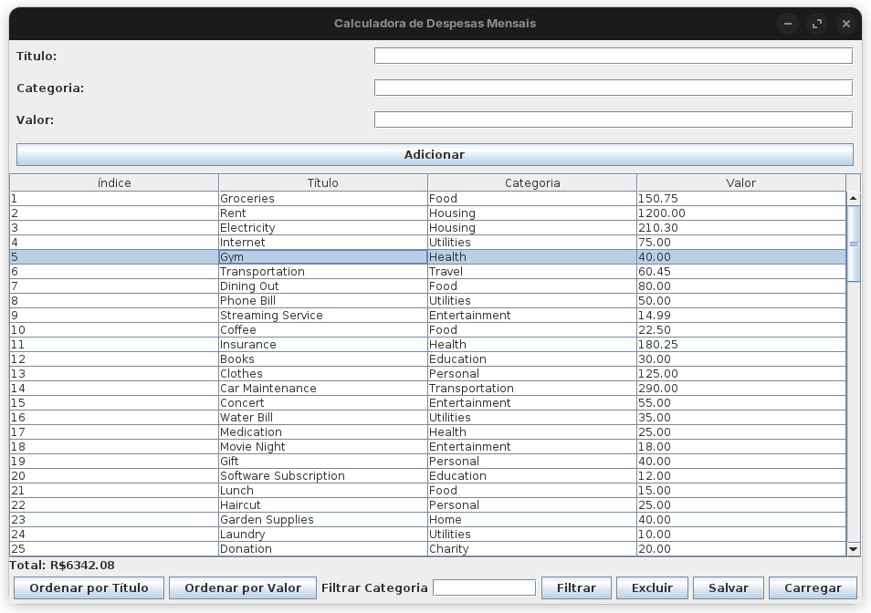

# Calculadora de Despesas Mensais

Este é um projeto em Java de uma calculadora de despesas mensais, desenvolvida com Swing para a interface gráfica. O sistema permite o registro, filtro, exclusão e cálculo do total de despesas, bem como a opção de salvar e carregar dados de um arquivo de texto.

## Funcionalidades

- Adicionar uma nova despesa com título, categoria e valor
- Listar todas as despesas em uma tabela
- Filtrar despesas por categoria
- Ordenar despesas por título ou valor
- Excluir despesas selecionadas
- Salvar e carregar despesas de um arquivo de texto

## Como Usar

1. Clone o repositório:
    ```bash
    git clone https://github.com/usuario/nome-do-repositorio.git
    ```
2. Compile e execute o projeto:
    ```bash
    javac ExpenseCalculator.java
    java com.project.ExpenseCalculator
    ```

## Dependências

Este projeto utiliza apenas bibliotecas padrão do Java, como `javax.swing` para a interface gráfica.

## Screenshots



## Autor

Criado por [Seu Nome](https://github.com/andrezktt)